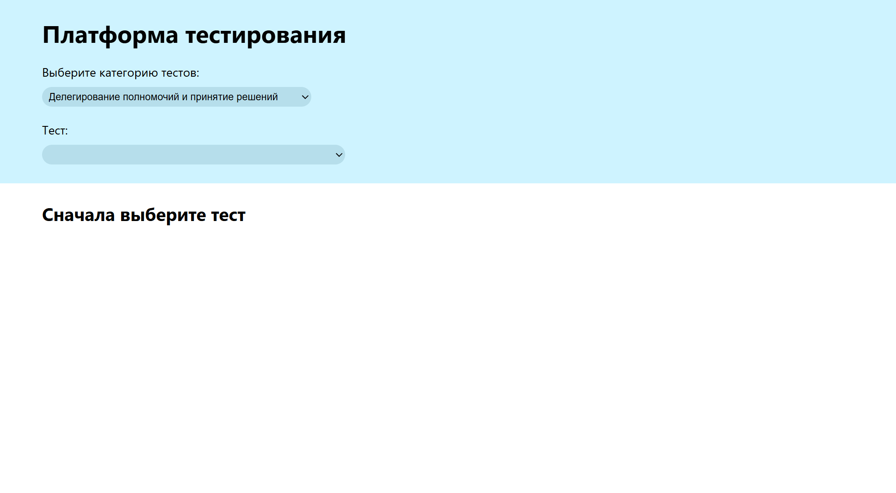
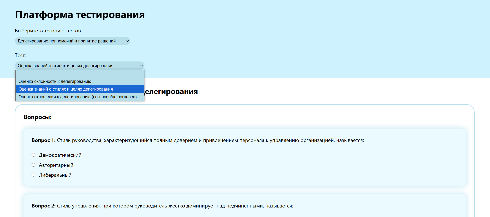
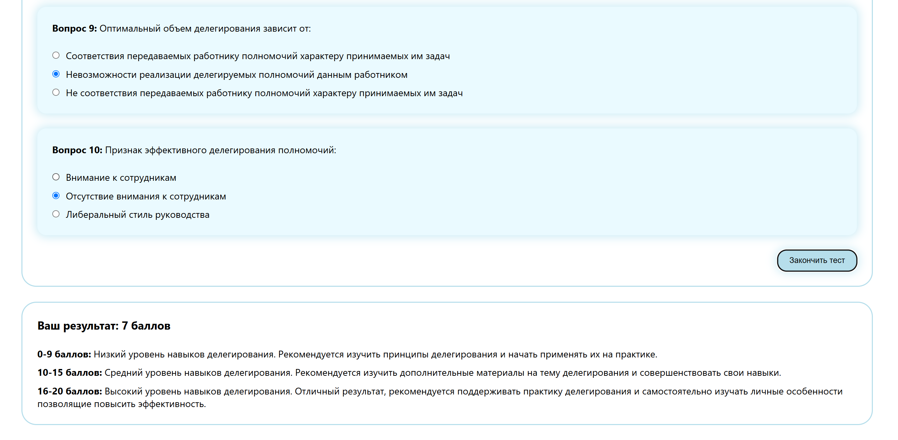

# Проект "Система тестирования"

## БГУИР, ФКП, Кафедра инженерной психологии и эргономики

### Дисциплина:
Психология управления и развития человеческих ресурсов

### Выполнили:

- Трушко Р.С.,
- Борейко А.А,
- Близнюк А.А,
- Макаров К.С.,
- Тарасов В.О.

### Ссылка на репозиторий:

[Github](https://github.com/ptrsshk/tests-system)

### Ссылка на приложение:

[Здесь](https://tests-system-ebon.vercel.app/)

### Скриншоты приложения

---

---
